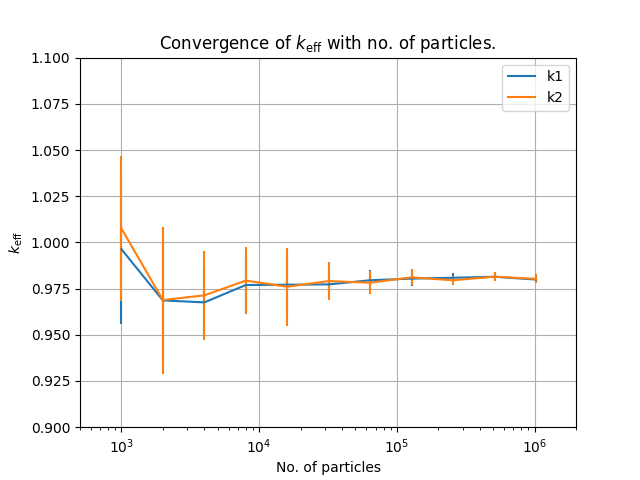
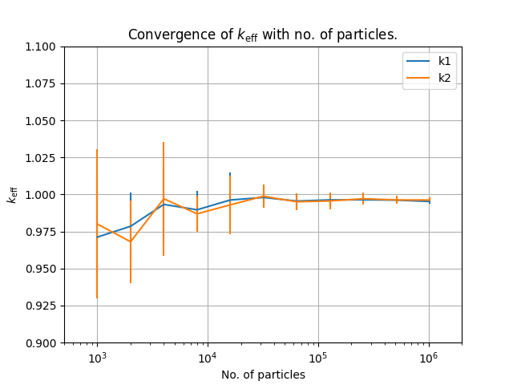
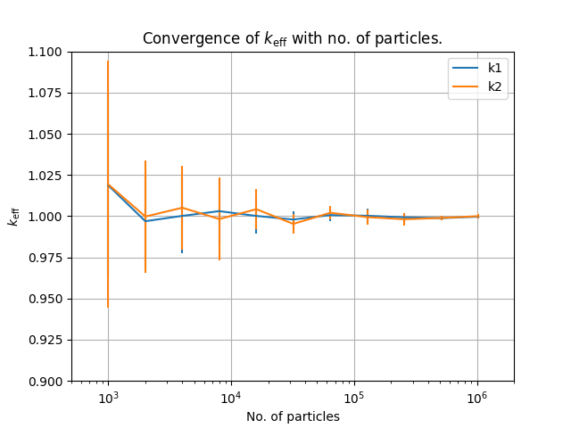
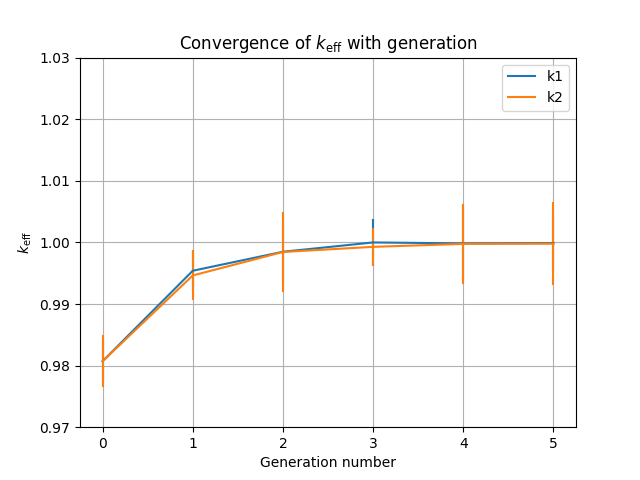
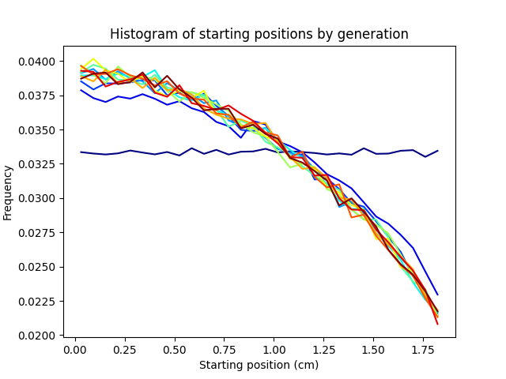

# Model and Results

This page integrates the project write-up from:

- `monte_carlo_criticality_code.md` (copied blog source in this repository).

## Transport model assumptions

The code solves a highly simplified criticality transport problem in slab
geometry:

- one spatial dimension (`x`)
- angular variable represented by direction cosine (`mu`)
- homogeneous material properties
- isotropic scattering
- no energy dependence
- steady-state eigenvalue formulation for `k_eff`

In words, neutrons stream, collide, and either scatter, fission, capture, or
leak. The unknown multiplication factor `k_eff` balances production and loss.

## Why generations matter

The write-up highlights a key point: a one-generation estimate with a uniformly
sampled initial source can converge with particle count, but still converge to
the wrong value. The reason is source-shape bias.

The current code addresses this by simulating multiple generations and using
fission locations from generation `g` to seed generation `g+1`. By around the
third generation in the demonstrated setup, the estimators stabilize near the
expected value.

## Algorithm summary

Per generation:

1. Start from a list of source positions.
2. Simulate each particle history until leakage, capture, or fission.
3. Record tallies and all fission-neutron source positions for the next
   generation.
4. Compute two `k_eff` estimates (`k1`, `k2`).

Per history:

1. Sample direction cosine in `[-1, 1]`.
2. Sample free-flight distance from an exponential distribution.
3. Update position and apply boundary condition.
4. If still inside slab, sample interaction type by roulette.
5. Terminate or continue based on the sampled event.

## Interpretation of outputs

- `particle_convergence.png`: effect of particle count on estimator mean and
  spread.
- `particle_convergence_gen2.png`: convergence study using two simulated
  generations.
- `particle_convergence_gen3.png`: convergence study using three simulated
  generations.
- `generations.png`: generation-to-generation convergence behavior of `k1`
  and `k2`.
- `fission_rate.png`: source distribution evolution toward the steady profile.

These outputs are generated by the CLI modes documented in
[CLI Usage](cli-usage.md).

### Convergence with one generation

### Convergence with two generations

### Convergence with three generations

### Estimator behavior by generation

### Fission-rate profile

## Scope and limitations

This is intentionally a toy code for clarity and experimentation. In particular,
it explicitly stores fission-neutron positions to seed the next generation,
which is practical here because the problem size is modest.
